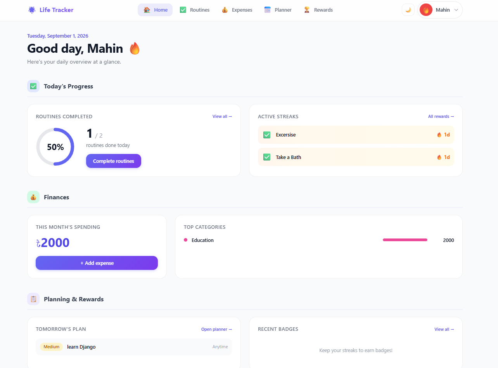

# 🌟 Life Tracker

<div align="center">


**Routines · Expenses · Planner · Streaks — one dashboard on your home WiFi**

[Features](#-features) • [Screenshots](#-screenshots) • [Quick Start](#-quick-start) • [Phone Install](#-use-on-your-phone-like-an-app) • [Tech Stack](#-tech-stack)

</div>

---

## ✨ What is it?

Life Tracker is a **multi-user personal dashboard** you run on your PC and open from any phone or tablet on the same WiFi — like your own private app.

| | |
|---|---|
| ✅ **Routines** | Daily habits with one-tap complete & streak flames |
| 💰 **Expenses** | Colorful charts by category & month |
| 📅 **Planner** | Plan tomorrow in morning / afternoon / evening blocks |
| 🏆 **Rewards** | Badges at 7, 14, 30, 60, 100-day streaks |
| 📲 **PWA** | Add to home screen — no IP typing after setup |

---

## 📸 Screenshots

> **To show images on GitHub:** save your screenshots in [`docs/screenshots/`](docs/screenshots/) and commit them to the repo. GitHub cannot display images that only exist on your PC.

| Dashboard | Profile Settings |
|:---:|:---:|
|  |  |
| Home overview — routines, streaks, expenses, planner | Avatar picker, theme color, currency & timezone |


---

## 🚀 Features

- **Daily Routines** — HTMX one-tap complete, weekly liquid progress bars
- **Streak System** — flame counters, badges at 7/14/30/60/100 days
- **Expense Tracker** — Chart.js doughnut, bar & month comparison charts
- **Next-Day Planner** — time blocks, priority colors, carry-over unfinished tasks
- **Draft Autosave** — Redis-backed form drafts (7-day TTL)
- **Multi-User** — separate accounts, isolated data per person
- **Dark Mode** — desktop & mobile, remembered in browser
- **LAN Access** — `http://<your-pc-ip>:8000` from any device on WiFi

---

## ⚡ Quick Start

### 1. Install Redis (Windows)

| Option | Link |
|---|---|
| **Memurai** (recommended) | [memurai.com](https://www.memurai.com/) |
| **WSL2** | `sudo apt install redis-server && sudo service redis-server start` |

### 2. Setup

```bash
git clone https://github.com/Mahin-Abrar/DaysGone.git
cd DaysGone
python -m venv venv
.\venv\Scripts\activate          # Windows
pip install -r requirements.txt
python manage.py migrate
python manage.py seed_data
python manage.py createsuperuser
```

### 3. Run

```bash
python manage.py runserver 0.0.0.0:8000
# Or double-click: run.bat
```

Find your PC IP: `ipconfig` → **IPv4 Address** (e.g. `192.168.0.102`)

Open locally: **http://localhost:8000**  
Open from phone: **http://192.168.0.102:8000**

> Allow Windows Firewall on **Private networks** when prompted.

---

## 📱 Use on your phone (like an app)

You only type the IP **once**. Then open from your home screen like a native app.

### Option 1 — Add to Home Screen (recommended)

| Platform | Steps |
|---|---|
| **iPhone** | Safari → Share → **Add to Home Screen** → name it *Life Tracker* |
| **Android** | Chrome → ⋮ → **Add to Home screen** (or tap Install banner) |

### Option 2 — Friendly URL

1. Windows **Settings → System → About → Rename PC** → `lifetracker`
2. On phone try: `http://lifetracker.local:8000`

### Option 3 — Bookmark

Save `http://<your-ip>:8000` as a bookmark.

Full guide when server is running: **http://localhost:8000/install/**

---

## 🛠 Tech Stack

```
Django 6  ·  SQLite  ·  Redis  ·  HTMX  ·  Tailwind CDN  ·  Chart.js  ·  PWA
```

| Layer | Choice |
|---|---|
| Backend | Django 6 + django-htmx |
| Database | SQLite (swap to PostgreSQL later if needed) |
| Cache / Sessions / Drafts | Redis via django-redis |
| UI | Server-rendered templates — no npm build step |
| Deploy | Local WiFi only (`runserver 0.0.0.0:8000`) |

---

## 🔐 Environment Variables

Create a `.env` file in the project root:

| Variable | Default | Description |
|---|---|---|
| `SECRET_KEY` | (dev key) | Django secret key |
| `DEBUG` | `True` | Debug mode |
| `ALLOWED_HOSTS` | `localhost,127.0.0.1,*` | Hosts for LAN |
| `REDIS_URL` | `redis://127.0.0.1:6379/1` | Redis connection |

---

## 📂 Project structure

```
├── accounts/      Auth, profile, avatars
├── routines/      Daily habits + weekly heatmap
├── expenses/      Spending + Chart.js
├── planner/       Next-day planner
├── rewards/       Streaks + badges
├── drafts/        Redis autosave API
├── templates/     HTML templates
├── static/        CSS, JS, PWA manifest
└── AGENTS.md      Guide for AI agents
```

---

## 🤖 For developers & AI agents

See **[AGENTS.md](AGENTS.md)** for full architecture, URL map, models, data flows, and conventions.

---

<div align="center">

**Made for daily life on your home network**

⭐ Star this repo if you find it useful

</div>
